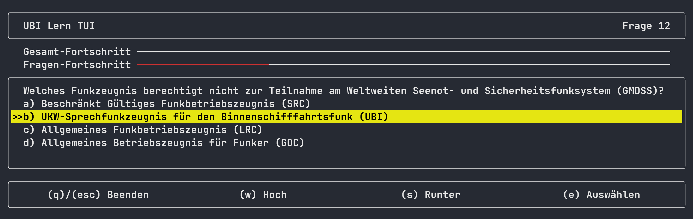
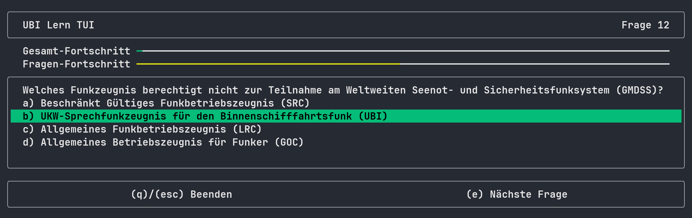
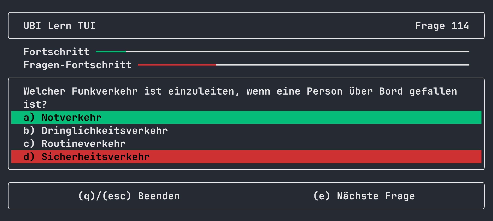

# ubilerntui

Eine Terminal UI, um für die "UKW-Sprechfunkzeugnis für den Binnenschiffahrtsfunk"-Prüfung zu lernen.

Ein großer Unterschied zu anderen Programmen, die das Gleiche versprechen, ist hier, dass die Fragen direkt eingelesen werden aus der PDF.
Sie können entsprechend den neuesten, offiziellen Fragenkatalog online finden ([zBsp. über duckduckgo](https://duckduckgo.com/?q=%2BUBI+Fragenkatalog+WSV+site%3Awsv.de+filetype%3Apdf&t=ffab&ia=web)) und mit diesem Programm automatisch parsen. Mehr dazu unter [Benutzung](#benutzung)




## Installation
### Über Cargo
```
cargo install ubilerntui
```


## Benutzung
```
Eine TUI, um für die UBI-Prüfung zu lernen.

Usage: ubilerntui.exe [OPTIONS] [COMMAND]

Commands:
  lade     Lädt eine UBI-Gesamtfragenkatalog-PDF-Datei in die interne Datenbank.
  loesche  Löscht alle Fragen oder den Fortschritt aus der Datenbank.
  help     Print this message or the help of the given subcommand(s)

Options:
      --license  Prints license information.
      --version  Prints version information.
  -h, --help     Print help (see more with '--help')
```

### Zum Starten
1. Laden Sie den offiziellen Fragenkatalog aus dem Netz. ([duckduckgo](https://duckduckgo.com/?q=%2BUBI+Fragenkatalog+WSV+site%3Awsv.de+filetype%3Apdf&t=ffab&ia=web))
2. Laden Sie diesen in das Program:
```bash
ubilerntui lade PFAD_ZUR_PDF
```
3. Starten Sie das Program:
```bash
ubilerntui
```

### Zurücksetzen des Lernfortschritts
```bash
ubilerntui loesche fortschritt
```

### Löschen der eingelesenen Fragen
```bash
ubilerntui loesche fragen
```


## Screenshots



