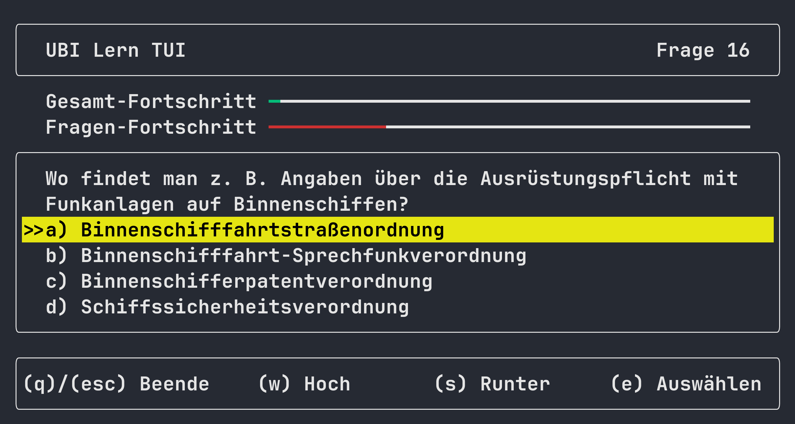
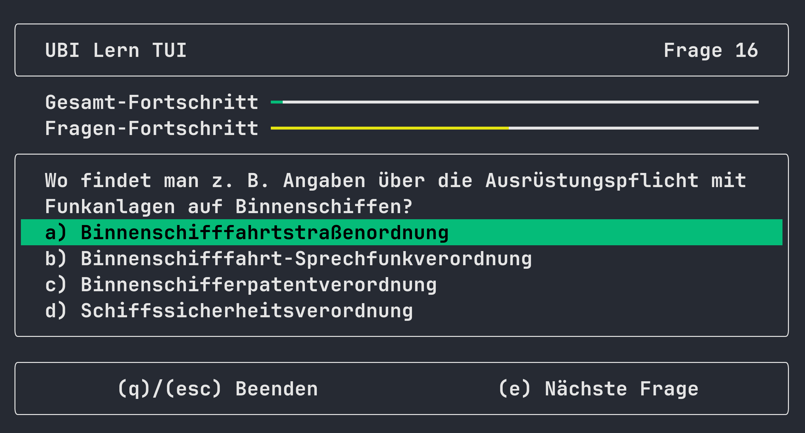
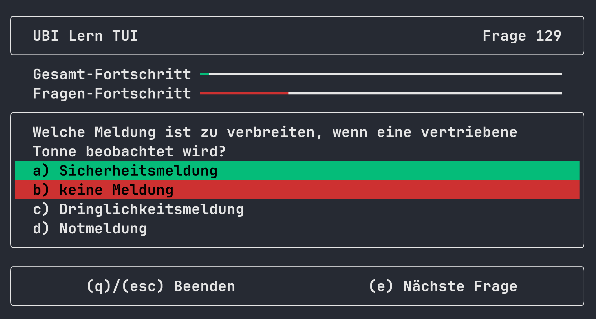

<div align="center">

# `ubilerntui`

**Eine Terminal UI, um für die "UKW-Sprechfunkzeugnis für den Binnenschiffahrtsfunk"-Prüfung zu lernen.**

[](https://deps.rs/repo/github/WyvernIXTL/ubilerntui)
[](https://crates.io/crates/ubilerntui)

</div>

Ein großer Unterschied zu anderen Programmen, die das Gleiche versprechen, ist hier, dass die Fragen direkt eingelesen werden aus der PDF.
Sie können entsprechend den neuesten, offiziellen Fragenkatalog online finden ([zBsp. über duckduckgo](https://duckduckgo.com/?q=%2BUBI+Fragenkatalog+WSV+site%3Awsv.de+filetype%3Apdf&t=ffab&ia=web)) und mit diesem Programm automatisch parsen. Mehr dazu unter [Benutzung](#benutzung).




## Installation
### Über [Cargo](https://doc.rust-lang.org/cargo/getting-started/installation.html)
```
cargo install ubilerntui
```


### Über Package Manager

#### [Scoop](https://scoop.sh/) *(windows)*
```
scoop bucket add stupid-bucket https://github.com/WyvernIXTL/stupid-bucket
scoop install stupid-bucket/ubilerntui
```


#### [Snap](https://snapcraft.io/) *(linux)*

```
sudo snap install ubilerntui
```
[](https://snapcraft.io/ubilerntui)


#### Apt *(x64 debian linux)*
```
wget https://github.com/WyvernIXTL/ubilerntui/releases/latest/download/ubilerntui-x64.deb
sudo apt install ./ubilerntui-x64.deb
rm ./ubilerntui-x64.deb
```


### Prebuilts
Für:
- windows
- linux
- macos

Auf der [Release Page](https://github.com/WyvernIXTL/ubilerntui/releases).


## Benutzung
```
Eine TUI, um für die UBI-Prüfung zu lernen.

Usage: ubilerntui.exe [OPTIONS] [COMMAND]

Commands:
  lade     Lädt eine UBI-Gesamtfragenkatalog-PDF-Datei in die interne Datenbank.
  loesche  Löscht alle Fragen oder den Fortschritt aus der Datenbank.
  help     Print this message or the help of the given subcommand(s)

Options:
      --license  Prints license information.
      --version  Prints version information.
  -h, --help     Print help (see more with '--help')
```

### Zum Starten
1. Laden Sie den offiziellen Fragenkatalog aus dem Netz. ([duckduckgo](https://duckduckgo.com/?q=%2BUBI+Fragenkatalog+WSV+site%3Awsv.de+filetype%3Apdf&t=ffab&ia=web))
2. Laden Sie diesen in das Program:
```bash
ubilerntui lade PFAD_ZUR_PDF
```
3. Starten Sie das Program:
```bash
ubilerntui
```

### Zurücksetzen des Lernfortschritts
```bash
ubilerntui loesche fortschritt
```

### Löschen der eingelesenen Fragen
```bash
ubilerntui loesche fragen
```

## Lizenz

Lizenziert unter [GNU General Public License v3.0 or later](./LICENSE.txt).
Diese Software benutzt Crates, welche unter anderen Lizenzen sind. Siehe [3rd Party Lizenzen](./LICENSE-3RD-PARTY.txt) (nur im Release enthalten).
Desweiteren benutzt diese Software ein `TeX-Trennmuster` der `Deutschsprachige Trennmustermannschaft` welches durch/in [hyphenation](https://github.com/tapeinosyne/hyphenation) enkodiert worden ist und der MIT Lizenz obliegt.


## Demo Video

[](https://asciinema.org/a/661416)


## Screenshots




